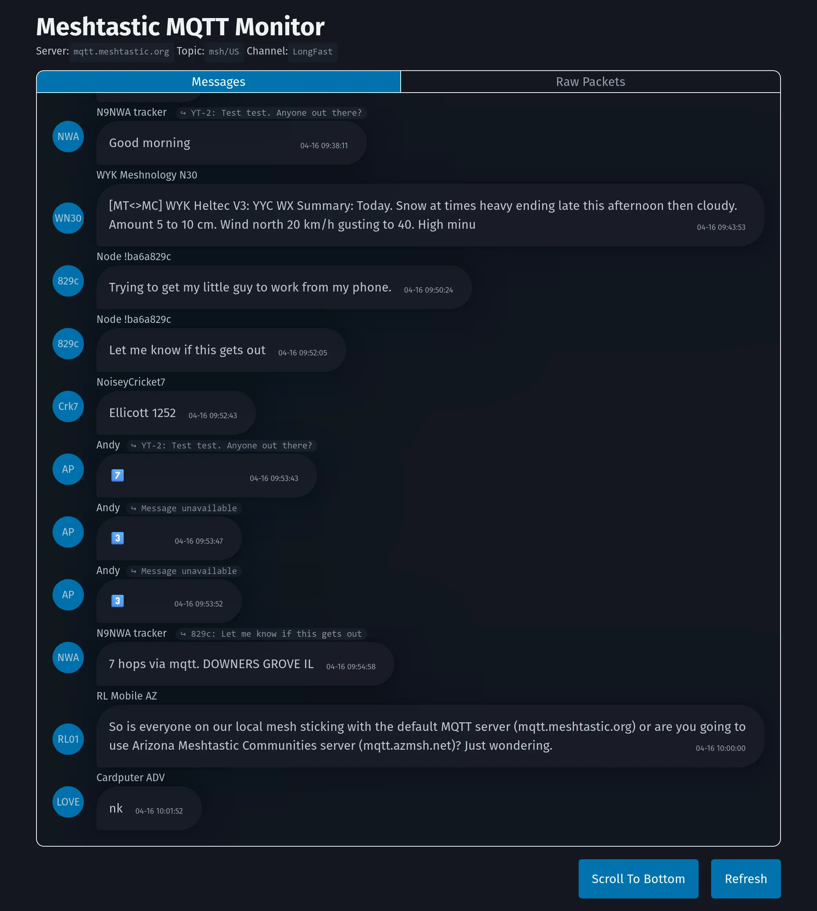
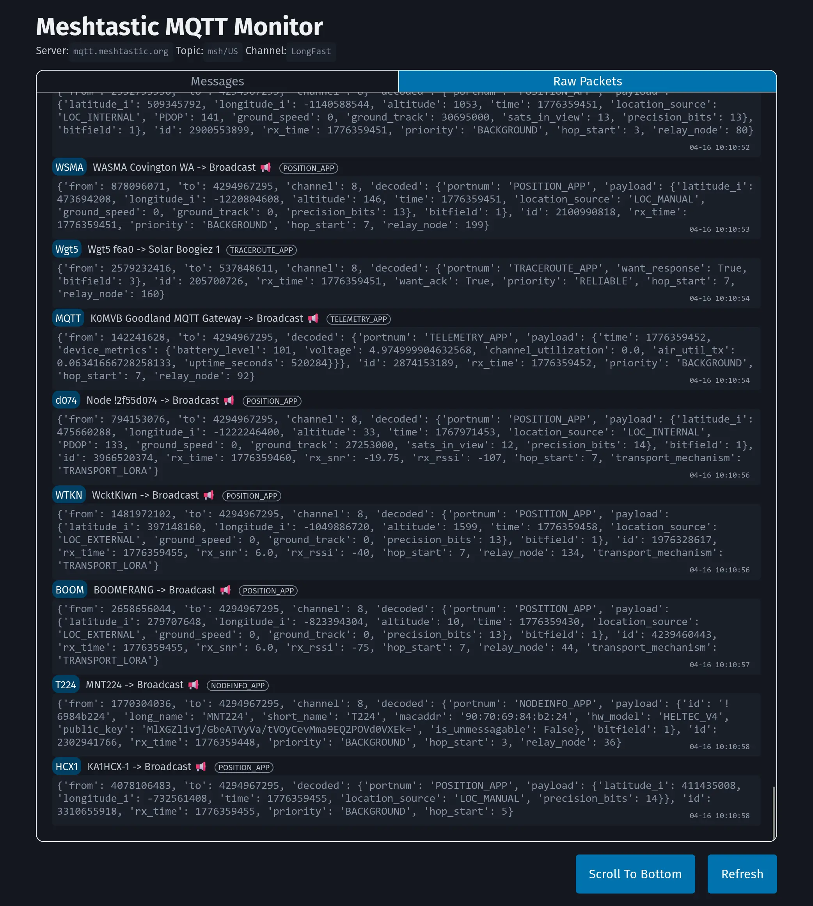

# MQTT Monitor for Meshtastic

A MQTT message and packet monitor for Meshtastic. Directly connect to MQTT server, no radio hardware required.

Mostly a simplified version of [pdxlocations/connect](https://github.com/pdxlocations/connect), read-only with a web interface.

|  |  |
| :----------------------------------------------------------: | :----------------------------------------------------------: |

## Usage

Run prebuilt docker image with default settings:

(official MQTT server `mqtt.meshtastic.org`, US default root topic `msh/US`)

```bash
docker run -d --name mqtt-monitor -p 5001:5001 \
           -v ./mqtt-monitor.db:/app/mqtt-monitor.db \
           ghcr.io/stevehawk/mqtt-monitor:latest
```

Run prebuilt image with CN settings:

(CN MQTT server `mqtt.mess.host`, CN default root topic `msh/CN`)

```bash
docker run -d --name mqtt-monitor -p 5001:5001 \
           -v ./mqtt-monitor.db:/app/mqtt-monitor.db \
           ghcr.io/stevehawk/mqtt-monitor:latest-cn
```

## Build locally

With default settings:

```bash
docker build -t mqtt-monitor:default --target default .
```

With CN settings:

```bash
docker build -t mqtt-monitor:cn --target cn .
```

## Available configs via environment variables

| name                           | default value                                                |
| ------------------------------ | ------------------------------------------------------------ |
| MQTT_MONITOR_ADDRESS           | mqtt.meshtastic.org (default image)<br />mqtt.mess.host (CN image) |
| MQTT_MONITOR_USERNAME          | meshdev                                                      |
| MQTT_MONITOR_PASSWORD          | large4cats                                                   |
| MQTT_MONITOR_ROOT_TOPIC        | msh/US (default image)<br />msh/CN (CN image)                |
| MQTT_MONITOR_CHANNEL           | LongFast                                                     |
| MQTT_MONITOR_KEY               | AQ==                                                         |
| MQTT_MONITOR_PACKET_KEEP_COUNT | 5000                                                         |
| MQTT_MONITOR_MESSAGE_KEEP_DAYS | 30                                                           |
